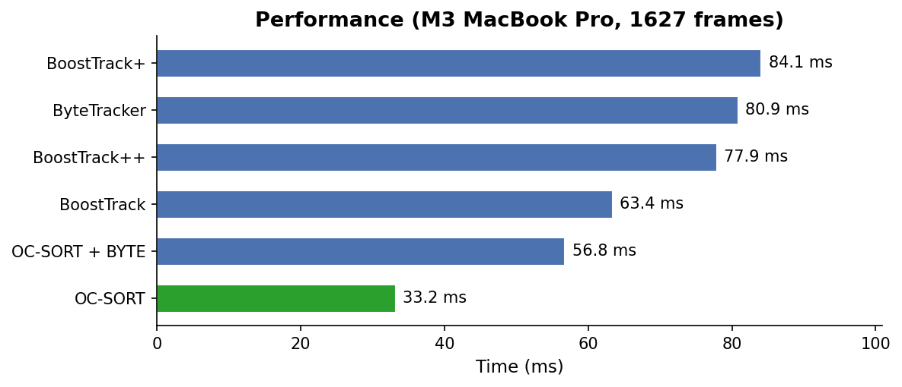
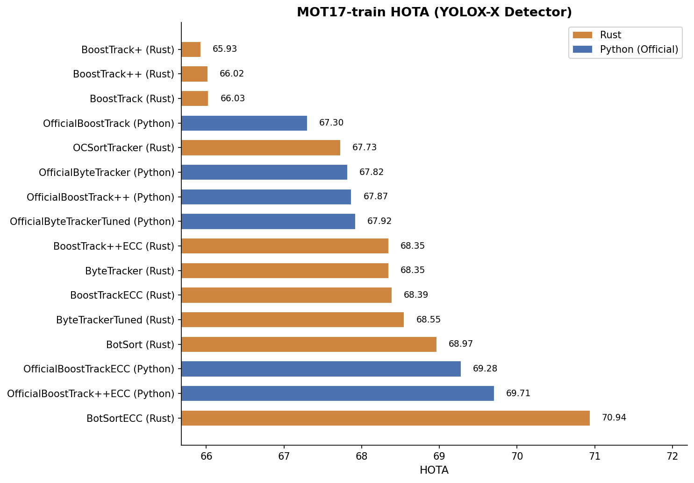
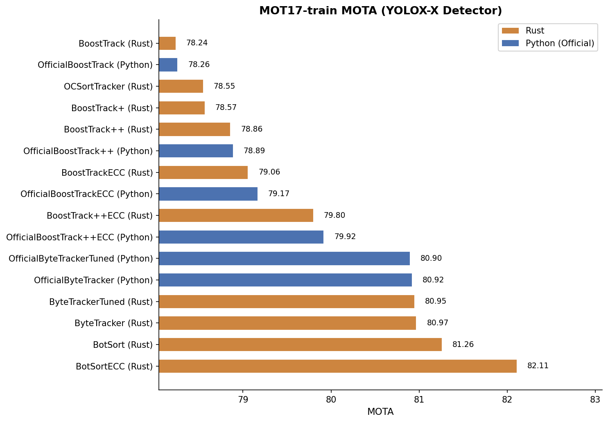
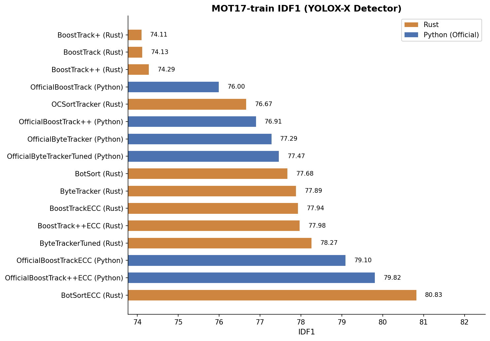
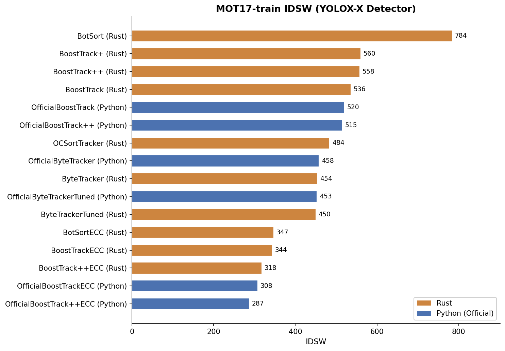

# JamTrack-rs

<p align="center">
    
</p>

[](https://github.com/kadu-v/jamtrack-rs/actions/workflows/swift.yml)

JamTrack-rs is a Rust crate that provides multi-object tracking algorithms including [ByteTrack](https://arxiv.org/abs/2110.06864), [BoT-SORT](https://arxiv.org/abs/2206.14651), [BoostTrack](https://arxiv.org/abs/2408.13003), and [OC-SORT](https://arxiv.org/abs/2203.14360).

## Features

- **ByteTracker**: Simple and efficient tracking using IoU-based association
- **BotSort**: BoT-SORT tracking with BYTE-style association, `xywh` Kalman filter, optional ECC camera compensation, and optional external ReID embeddings
- **BoostTracker**: Advanced tracking with confidence boosting techniques
  - **BoostTrack**: Basic DLO/DUO confidence boost
  - **BoostTrack+**: Rich similarity (Mahalanobis distance + shape + soft BIoU)
  - **BoostTrack++**: Rich similarity + soft boost + varying threshold
- **OC-SORT**: Observation-Centric SORT with online smoothing
  - IoU + VDC (Velocity Direction Consistency) association
  - BYTE association for low-confidence detections
  - OCR (Observation-Centric Re-association) with last observation
  - Kalman filter freeze/unfreeze for online smoothing

## Demo


<div align="center">
    <video controls src="https://github.com/user-attachments/assets/0cd32cd9-75e6-4540-9933-926c4264a43f" muted="false" width="500"></video>
</div>

**Individual tracker demos:** [ByteTracker](https://github.com/user-attachments/assets/dc135e90-4296-408e-8309-bfd921c06700) | [BoT-SORT](https://github.com/user-attachments/assets/3b4ec6ed-8c74-49f5-9488-5d453c768c66) | [BoostTracker](https://github.com/user-attachments/assets/a3c9c252-cb32-4944-8820-fe981588b90e) | [BoostTracker+](https://github.com/user-attachments/assets/6e05a5ec-337c-4aa9-9202-f635acf56050) | [BoostTracker++](https://github.com/user-attachments/assets/e5c93888-b0b7-42cd-af87-b22dfbe063fe)

## Installation

### Rust

Add the following to your `Cargo.toml`:

```toml
[dependencies]
jamtrack-rs = { git = "https://github.com/kadu-v/jamtrack-rs.git" }
```

### Swift (via Swift Package Manager)

The Swift package is distributed as [JTrackers](https://github.com/kadu-v/JTrackers). Add it in Xcode via **File > Add Package Dependencies** with the URL:

```
https://github.com/kadu-v/JTrackers.git
```

Or add it to your `Package.swift`:

```swift
dependencies: [
    .package(url: "https://github.com/kadu-v/JTrackers.git", from: "0.4.0"),
]
```

## Usage

### ByteTracker

```rust
use jamtrack_rs::byte_tracker::ByteTracker;
use jamtrack_rs::object::Object;
use jamtrack_rs::rect::Rect;

// Create tracker: track_thresh, track_buffer, match_thresh
let mut tracker = ByteTracker::new(0.5, 30, 0.8);

// Create detections
let detections = vec![
    Object::new(Rect::new(100.0, 100.0, 50.0, 80.0), 0.9, None),
    Object::new(Rect::new(200.0, 150.0, 60.0, 90.0), 0.85, None),
];

// Update tracker
let tracks = tracker.update(&detections);

for track in tracks {
    println!("Track ID: {:?}, Rect: {:?}", track.get_track_id(), track.get_rect());
}
```

### BoostTracker

```rust
use jamtrack_rs::boost_tracker::BoostTracker;
use jamtrack_rs::object::Object;
use jamtrack_rs::rect::Rect;

// Create tracker: det_thresh, iou_threshold, max_age, min_hits
let mut tracker = BoostTracker::new(0.5, 0.3, 30, 3);

// Create detections
let detections = vec![
    Object::new(Rect::new(100.0, 100.0, 50.0, 80.0), 0.9, None),
    Object::new(Rect::new(200.0, 150.0, 60.0, 90.0), 0.85, None),
];

// Update tracker
let tracks = tracker.update(&detections).unwrap();

for track in tracks {
    println!("Track ID: {:?}, Rect: {:?}", track.get_track_id(), track.get_rect());
}
```

### BoT-SORT

```rust
use jamtrack_rs::bot_sort_tracker::BotSort;
use jamtrack_rs::object::Object;
use jamtrack_rs::rect::Rect;

let mut tracker = BotSort::new(30, 30, 0.6, 0.1, 0.7, 0.8);
let detections = vec![
    Object::new(Rect::new(100.0, 100.0, 50.0, 80.0), 0.9, None),
];

let tracks = tracker.update(&detections).unwrap();
```

BoT-SORT can also run ECC camera motion compensation when the caller provides grayscale frames:

```rust
use image::GrayImage;

let mut tracker = BotSort::new(30, 30, 0.6, 0.1, 0.7, 0.8)
    .with_ecc();
let frame = GrayImage::new(640, 480);

let tracks = tracker.update_with_frame(&detections, &frame).unwrap();
```

BoT-SORT ReID matching is optional and expects embeddings from the caller:

```rust
let mut tracker = BotSort::new(30, 30, 0.6, 0.1, 0.7, 0.8)
    .with_reid(true);
let features = vec![vec![1.0, 0.0, 0.0]];

let tracks = tracker.update_with_features(&detections, &features).unwrap();
```

### BoostTracker+ / BoostTracker++

```rust
use jamtrack_rs::boost_tracker::BoostTracker;

// BoostTrack+ (rich similarity)
let mut tracker_plus = BoostTracker::new(0.5, 0.3, 30, 3)
    .with_boost_plus();

// BoostTrack++ (rich similarity + soft boost + varying threshold)
let mut tracker_plus_plus = BoostTracker::new(0.5, 0.3, 30, 3)
    .with_boost_plus_plus();

// Custom configuration
let mut custom_tracker = BoostTracker::new(0.5, 0.3, 30, 3)
    .with_lambdas(0.6, 0.2, 0.2)  // lambda_iou, lambda_mhd, lambda_shape
    .with_boost(true, false)      // use_dlo_boost, use_duo_boost
    .with_boost_plus_plus();
```

### OC-SORT

```rust
use jamtrack_rs::oc_sort_tracker::OCSort;
use jamtrack_rs::object::Object;
use jamtrack_rs::rect::Rect;

// Create tracker with detection threshold
let mut tracker = OCSort::new(0.5)
    .with_max_age(30)
    .with_min_hits(3)
    .with_iou_threshold(0.3)
    .with_delta_t(3)
    .with_inertia(0.2)
    .with_byte(false); // enable BYTE association for low-score detections

// Create detections
let detections = vec![
    Object::new(Rect::new(100.0, 100.0, 50.0, 80.0), 0.9, None),
    Object::new(Rect::new(200.0, 150.0, 60.0, 90.0), 0.85, None),
];

// Update tracker
let tracks = tracker.update(&detections).unwrap();

for track in tracks {
    println!("Track ID: {:?}, Rect: {:?}", track.get_track_id(), track.get_rect());
}
```

## Benchmark

Tested on M3 MacBook Pro with 1627 frames from detection_results.json.

### Performance

<div align="center">
    
</div>

### Why is BoostTrack++ faster than BoostTrack+?

BoostTrack++ performs more computation per frame (soft boost + varying threshold), but maintains fewer active tracks due to better matching:

| Tracker | Avg Tracks | Max Tracks |
|---------|------------|------------|
| BoostTrack | 32.12 | 46 |
| BoostTrack+ | 30.94 | 45 |
| BoostTrack++ | **28.97** | 43 |

Fewer tracks = smaller similarity matrices = faster downstream computation.

### Run Benchmarks

```bash
cargo bench
```

### MOT17-train Benchmark (YOLOX-X Detector)

Evaluation results on MOT17 train set using YOLOX-X detector:

<div align="center">
    
    
    
    
</div>

> [!NOTE]
> - ECC variants show significant improvement in HOTA/IDF1/IDSW due to camera motion compensation
> - Rust BoostTrack and BoT-SORT support ECC camera motion compensation
> - BoT-SORT ReID matching is implemented, but the MOT17 benchmark above uses the non-ReID path for fair comparison with non-embedding tracker variants
> - MOTA is determined by the core algorithm, so Rust and Python versions achieve nearly identical values
> - *Tuned* variants use optimized hyperparameters of a tracker for MOT17 dataset


## Examples

Run the examples with detection data:

```bash
# ByteTracker
cargo run --example example_byte_tracker

# BoostTracker (basic)
cargo run --example example_boost_tracker

# BoostTracker with mode selection
cargo run --example example_boost_tracker_modes basic
cargo run --example example_boost_tracker_modes plus
cargo run --example example_boost_tracker_modes plusplus

# BoT-SORT
cargo run --example example_bot_sort
```

## Tracker Comparison

| Feature | ByteTracker | BoT-SORT | BoostTrack | BoostTrack+ | BoostTrack++ | OC-SORT |
|---------|-------------|----------|------------|-------------|--------------|---------|
| IoU Association | Yes | Yes | Yes | Yes | Yes | Yes |
| Mahalanobis Distance | No | No | Yes | Yes | Yes | No |
| Shape Similarity | No | No | No | Yes | Yes | No |
| DLO Confidence Boost | No | No | Yes | Yes | Yes | No |
| DUO Confidence Boost | No | No | Yes | Yes | Yes | No |
| Rich Similarity | No | No | No | Yes | Yes | No |
| Soft Boost | No | No | No | No | Yes | No |
| Varying Threshold | No | No | No | No | Yes | No |
| VDC (Velocity Direction Consistency) | No | No | No | No | No | Yes |
| OCR (Re-association) | No | No | No | No | No | Yes |
| Online Smoothing (Freeze/Unfreeze) | No | No | No | No | No | Yes |
| BYTE Association | Yes | Yes | No | No | No | Yes |
| Embedding (Re-ID) | No | Optional | No | No | No | No |
| ECC (Camera Motion Compensation) | No | Yes | Yes | Yes | Yes | No |

## References

- [ByteTrack: Multi-Object Tracking by Associating Every Detection Box](https://arxiv.org/abs/2110.06864)
- [BoT-SORT: Robust Associations Multi-Pedestrian Tracking](https://arxiv.org/abs/2206.14651)
- [BoostTrack: Boosting the Similarity Measure and Detection Confidence for Improved Multiple Object Tracking](https://arxiv.org/abs/2408.13003)
- [OC-SORT: Observation-Centric SORT on video Multi-Object Tracking](https://arxiv.org/abs/2203.14360)

## License

MIT License
